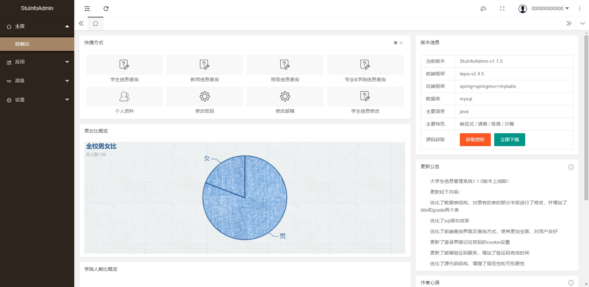

## 项目简介
这个项目是一个大学生信息管理系统,提供用户级别的登录注册资料管理,信息查询,信息修改（管理员权利），简单的数据可视化分析等功能，也有基本的安全性保障*


## 版本介绍
### V1.1.0
*目前的项目版本为 1.1.0,后期续将持续优化~*

*更新如下内容 :*
* 优化数据表结构，对原有的表的部分字段进行了修改，并增加了title和grade两个表
* 优化sql语句效率
* 优化前端查询界面及查询方式，使其更加全面，对用户友好
* 更新登录界面记住密码的cookie设置
* 更新邮箱验证码服务，增加了验证码有效时间
* 优化源代码结构，增强了规范性和可拓展性

### V2.0.0
*使用`SpringBoot`重构`SSM`,`Thymeleaf`重构`JSP`,提高项目的实用性及扩展性,尽情期待哟~*


## 项目技术
### 前端
* 前端框架 : `layui`
* 数据可视化框架 : `echarts`

### 后端
* IOC容器 : `Spring`
* Web框架 : `SpringMVC`
* ORM框架 : `Mybatis`
* 日志框架 : `Log4j`
* 安全框架 : `Shiro`


## 项目结构
```
├─database                          // 数据库相关文件
│  ├─design				                  // 数据库设计
│  │  └─1
│  └─sql                            // 数据库初始化脚本文件
├─git_screenshot                    // 存放README.md 中的图片
├─src                               // 项目源代码目录
│  ├─main                           //源代码目录
│  │  ├─java
│  │  │  └─com
│  │  │      └─springmvc            // java代码目录
│  │  │          ├─controller       // 控制层
│  │  │          ├─dao              // 持久层
│  │  │          ├─dto              // 传输对象
│  │  │          ├─entity           // 实体类
│  │  │          ├─interceptor      // 拦截器
│  │  │          ├─log              // 日志管理
│  │  │          ├─service          // 服务层
│  │  │          │  └─impl          // 服务层接口实现
│  │  │          └─util             // 工具方法
│  │  ├─resources                   // 资源文件目录
│  │  │  └─com
│  │  │      └─springmvc
│  │  │          └─mapper           // mybatis对dao接口的xml实现
│  │  └─webapp                      // tomcat前端文件目录
│  │      ├─static                  // 静态资源
│  │      │  ├─custom               // 自定义静态资源
│  │      │  └─plugins              // 插件类静态资源
│  │      └─WEB-INF
│  │          └─page                // jsp页面目录 
│  └─test                           // 测试代码目录
├─README.md                         // help
└─pom.xml                           // maven依赖
```


## 运行指南
### 1 : 项目开发环境
- IDE : `IntelliJ IDEA 2018.1.7`
- 项目构建工具 : `Maven 3.x`
- 数据库 : `Mysql 8.0.13`
- JDK版本 : `jdk 1.8`
- Tomcat版本 : `Tomcat 8.x`


### 2 : 项目的初始构建
1. *在你的Mysql中，运行我提供的database/sql/init.sql 文件（注意mysql版本与sql脚本中部分代码的兼容性）, 成功会创建名为mydatabase2的数据库，以及user、student、teacher、class、major、college、title、grade八个表*

*数据库物理模型如下 :*


2. *进入src/main/resources修改dbconfig.properties配置文件,把数据库登录名和密码，改为你本地的*

3. *进入src/main/resources查看log4j.properties，如果有必要可以修改日志输出路径，目前在D盘下，你可选择不修改跳过此步*

4. *使用 IntelliJ IDEA 导入项目，选择Maven项目选项，一路点击next，即可将项目所需依赖导入。若有无法引入的依赖，可能是因为maven版本不同或是该依赖已过时不存在于现有maven仓库中，请前往maven官网映入最新的该类型依赖*


5. *在 IntelliJ IDEA 中，配置我们的 Tomcat， 然后把使用Maven构建好的项目添加到Tomcat中，相关方法可以参考百度*

6. *用户登录页面*


7. *登录账户/密码(你也可以自行注册一个账户登录哟)*
  - 管理员账户：000000000000/admin1
  - 学生账户：516030910429/123456
  - 教师账户：1000000001/123456


## 功能模块介绍
### 用户服务
* 登录：如上文图所示

* 注册

  

* 忘记密码后的重置密码（含发送邮箱验证码）

  

* 登录进入主页

  

* 修改基本资料

  

* 修改密码

  

* 修改绑定邮箱

  


### 信息查询
* 学生信息查询

  * 查询所有信息

    

  * 根据登录用户的用户名（应以学号注册）查询当前个人的学籍信息，若注册时未以真实学号注册，则无法查询到。

    

  * 模糊查询搜索

    

* 教师信息查询：类似学生信息查询，图略

* 班级信息查询：类似学生信息查询，图略

* 专业&学院信息查询：类似学生信息查询，图略


### 信息修改
* 学生信息修改

  * 此功能必须以管理员用户身份登录，否则会跳转至异常页面

    

  * 编辑信息

    

  * 添加

    

  * 单条、多条删除

    

* 教师信息修改：类似学生信息修改，图略

* 班级信息修改：类似学生信息修改，图略

* 专业&学院信息修改：类似学生信息修改，图略


### 拓展功能
* 学生男女比可视化


* 学生人数比可视化


* 师资力量可视化

  

## 安全性

### 1 : 未登录用户进入系统
*通过`LoginInterceptor.java`拦截器直接将未登录用户重定向到登录页面`login.jsp`,并用`log4j`记录当前日志*

```java
public class LoginInterceptor implements HandlerInterceptor {
    private final static Logger logger = Logger.getLogger(LoginInterceptor.class);

    @Override
    public boolean preHandle(HttpServletRequest httpServletRequest, HttpServletResponse httpServletResponse, Object o) throws Exception {
        String userId = (String) httpServletRequest.getSession().getAttribute("userId");
        if (userId != null && userId != "") {
            logger.info(userId + "访问系统！");
            return true;
        }
        logger.info(userId + "未登录下企图进入系统！");
        httpServletResponse.sendRedirect(httpServletRequest.getContextPath() + "/login");
        return false;
    }
}
```

### 2 : 非管理员访问信息修改页面
*通过AuthorityInterceptor拦截器直接将非管理员未用户重定向到错误提示录页面error.jsp，并用log4j记录当前日志*

```java
public class AuthorityInterceptor implements HandlerInterceptor {
    private final static Logger logger = Logger.getLogger(AuthorityInterceptor.class);

    @Autowired
    private UserService userService;

    @Override
    public boolean preHandle(HttpServletRequest httpServletRequest, HttpServletResponse httpServletResponse, Object o) throws Exception {
        if (userService.ifAdmin(httpServletRequest.getSession(), httpServletRequest)) {
            logger.info("管理员访问:" + httpServletRequest.getRequestURI());
            return true;
        }
        logger.info("非管理员访问:" + httpServletRequest.getRequestURI() + " 无操作权限");
        httpServletResponse.sendRedirect(httpServletRequest.getContextPath() + "/error");
        return false;
    }
}
```

### 3 : 防止用户重复提交表单
*定义Token注解并实现,在访问页面时产生token,在执行ajax或其他与服务端的交互时删除token,对比前后token差异判断是否重复提交了表单*

```java
@Target(ElementType.METHOD)
@Retention(RetentionPolicy.RUNTIME)
public @interface Token {
    boolean save() default false;
    boolean remove() default false;
}
```

```java
public class TokenInterceptor extends HandlerInterceptorAdapter {
    private final static Logger logger = Logger.getLogger(TokenInterceptor.class);

    @Override
    public boolean preHandle(HttpServletRequest request, HttpServletResponse response, Object handler) throws Exception {
        if (handler instanceof HandlerMethod) {
            HandlerMethod handlerMethod = (HandlerMethod) handler;
            Method method = handlerMethod.getMethod();
            Token annotation = method.getAnnotation(Token.class);
            if (annotation != null) {
                boolean needSaveSession = annotation.save();
                if (needSaveSession) {
                    request.getSession(false).setAttribute("token", UUID.randomUUID().toString());
                }
                boolean needRemoveSession = annotation.remove();
                if (needRemoveSession) {
                    if (isRepeatSubmit(request)) {
                        logger.info(request.getSession().getAttribute("userId")+"重复提交了表单");
                        response.sendRedirect(request.getContextPath() + "/formRepeatSubmit");
                        return false;
                    }
                    request.getSession(false).removeAttribute("token");
                }
            }
            return true;
        } else {
            return super.preHandle(request, response, handler);
        }
    }

    private boolean isRepeatSubmit(HttpServletRequest request) {
        String serverToken = (String) request.getSession(false).getAttribute("token");
        System.out.println(serverToken);
        if (serverToken == null) {
            return true;
        }
        String clinetToken = request.getParameter("token");
        System.out.println(clinetToken);
        if (clinetToken == null) {
            return true;
        }
        if (!serverToken.equals(clinetToken)) {
            return true;
        }
        return false;
    }
}
```


### 4 : MD5带盐加密
*通过shiro框架提供的加密算法,使用md5散列对用户的密码加密，对存储到mysql中,这里盐为用户id,加密次数为5次,即`en_pass=MD(MD(MD(MD(MD( userId+userPassword )))))`,盐选定为用户id这个唯一标识可以提升加密的安全性，盐的使用也可以有效防止md破解工具*

```java
public class MySecurity {
    private static int hashIterations=5;

    /**
     * @Author JinZhiyun
     * @Description md5加密，加密内容source,带盐加密salt，指定加密次数：hashIterations
     * @Date 11:06 2019/5/12
     * @Param [source, salt]
     * @return java.lang.String
     **/
    public static String encryptUserPassword(String source, String salt){
        return new Md5Hash(source, salt, hashIterations).toBase64();
    }
}
```
